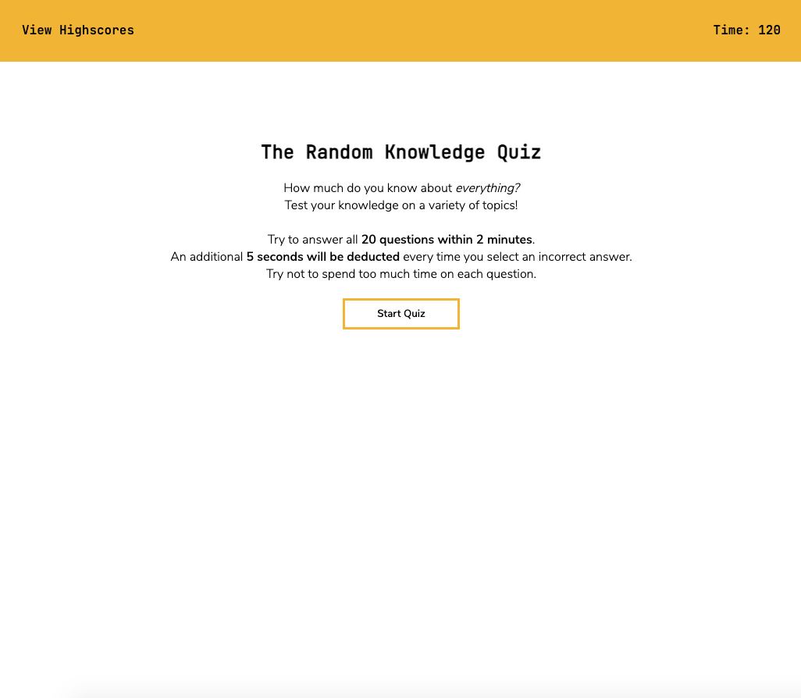
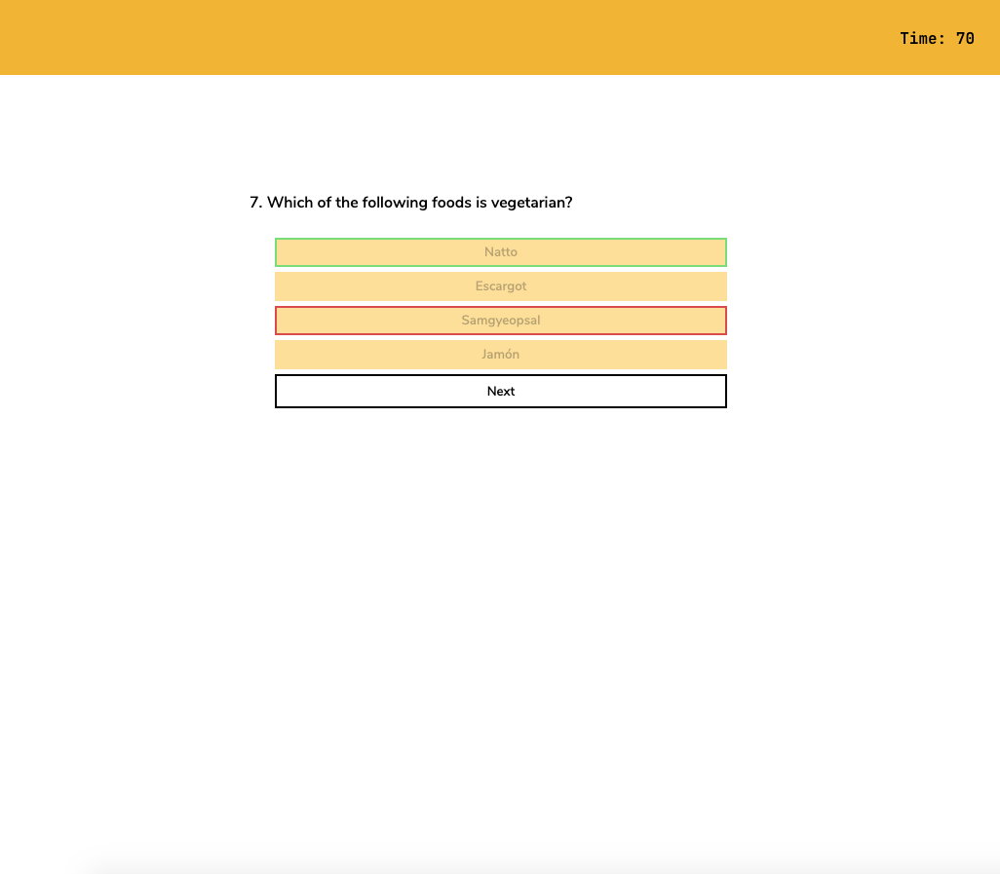
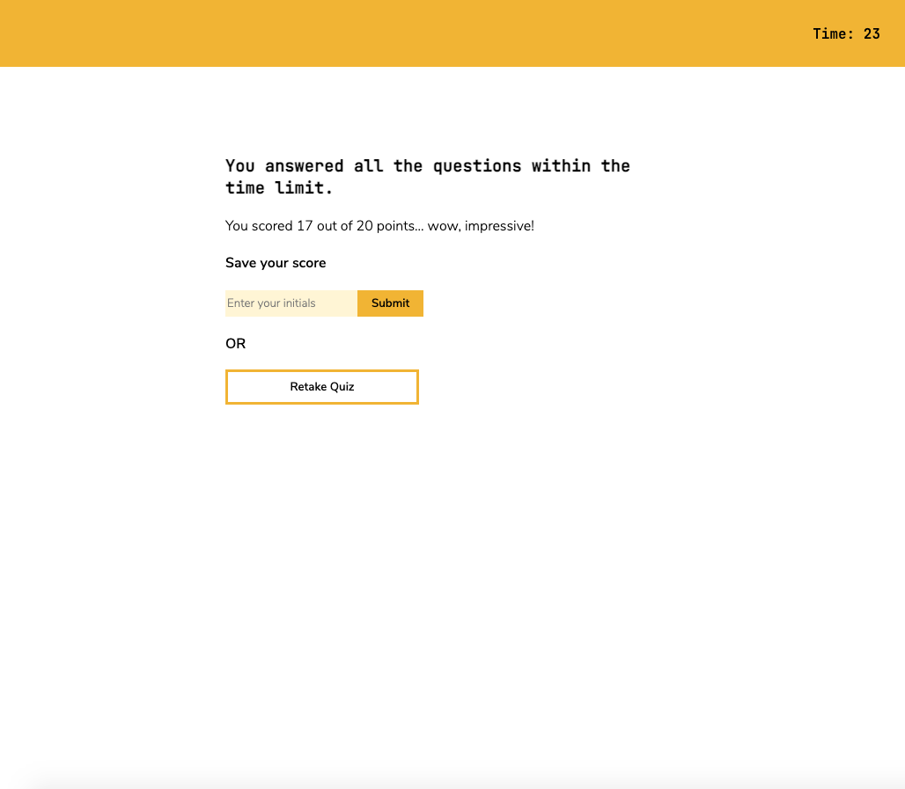
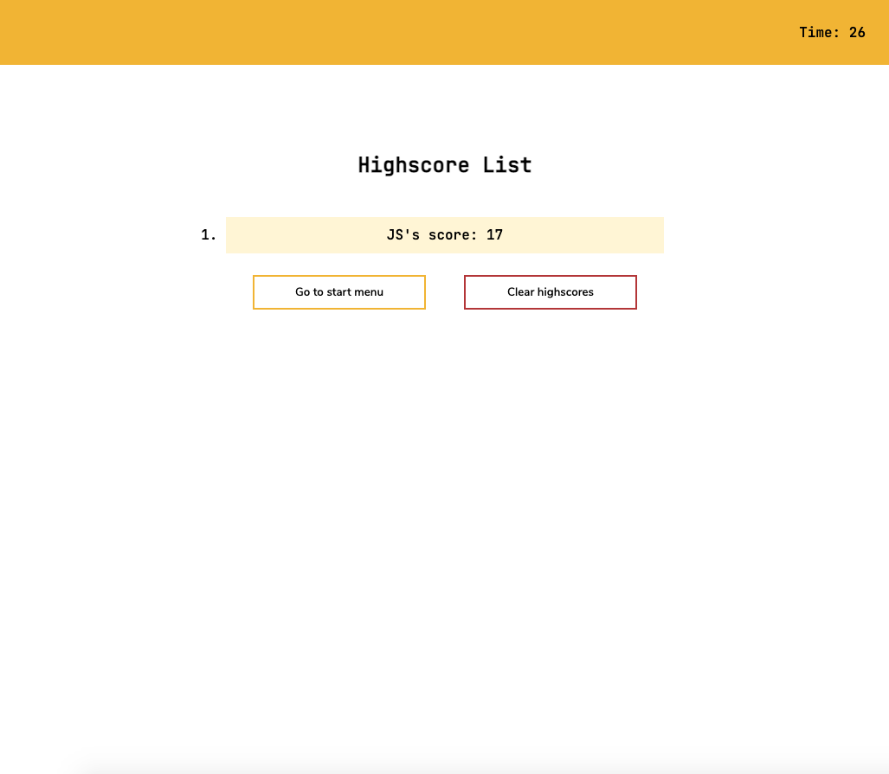

# Quiz Website: The Random Knowledge Quiz

## Description 

This is a multiple-choice quiz web application designed purely for entertainment purposes. The quiz begins when the 'Start Quiz' button is clicked and consists of 20 randomly selected questions on a variety of topics, to be answered within 2 minutes. When all questions are answered, or the 2 minutes are up, users will receive a score out of 20 and can choose to save their score for future reference.

## Screenshots

### Start menu

### Quiz questions

### Completion of quiz

### Highscore list

## Link

[Link to deployed application](https://jkaho.github.io/quiz-website/)
